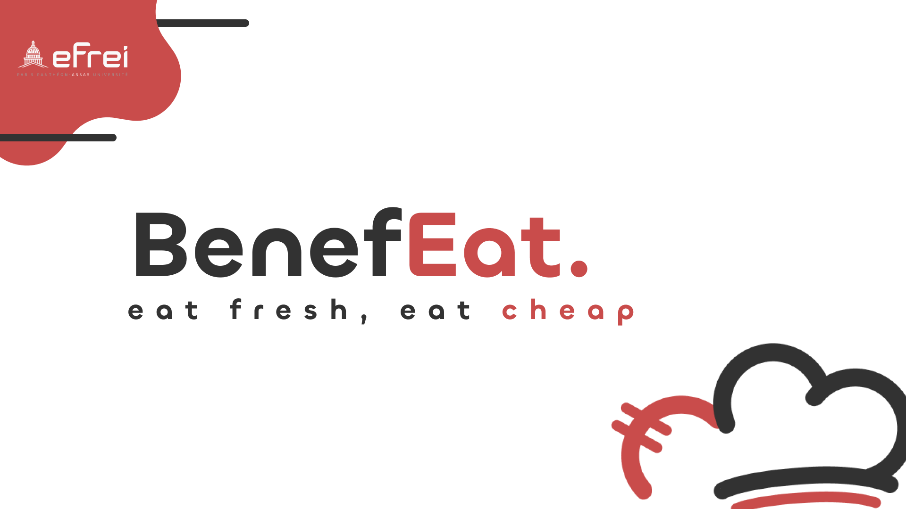
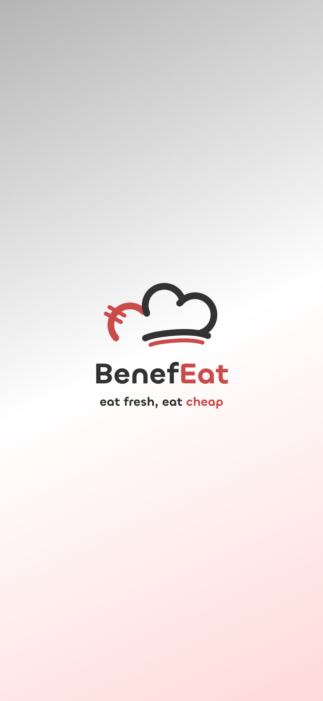
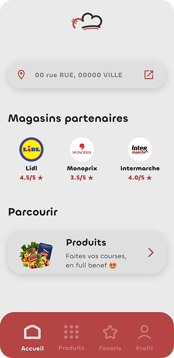

# BenefEat

**BenefEat** est une application mobile Flutter réalisée dans le cadre du **Delivery Project (P2 BDX 2028 – EFREI S4)**.  
Elle aide l’utilisateur à **chercher des produits**, **gérer ses favoris**, **constituer un panier**, et **obtenir une suggestion de magasins** proches selon le contenu du panier.

## Objectifs

- **Avoir une application fonctionnelle** avec un design soigné
- **Construire un socle de données produits/recettes** (dont une partie via web scraping)
- **Explorer l’accès aux stocks/prix** des chaînes (démarche initiée mais non aboutie)

## Aperçu

<p float="left">
  
  
  
</p>

## Fonctionnalités

- **Gestion du profil utilisateur**
  - Création de profil, connexion
  - Modification et suppression des données
  - Photo de profil
  - Stockage des informations utilisateur (email, nom, prénom, adresse…)

- **Gestion des produits**
  - Base produits (nom, marque, quantité, prix, prix par quantité)
  - Recherche
  - Ajout au panier
  - Ajout aux favoris
  - Depuis le panier : **suggestion de magasin**
  - Depuis les favoris : ajout au panier en accès direct

- **Navigation générale**
  - Liste de commerces proches de l’utilisateur
  - Accès au profil et aux informations personnelles
  - Affichage d’un **score** (rapport qualité/prix du panier moyen) par chaîne de commerce
  - Page “Settings” (compte, contact)

## Technologies

- **Frontend**: Flutter (Dart) — Android / iOS
- **Backend / logique**: Dart
- **Données**:
  - JSON (local)
  - SQLite (`sqflite`) avec une base embarquée (`assets/data/databases.db`)
- **Design**: Figma

## Design (principes)

- **Palette minimaliste** avec une dominante **rouge** (couleur “marque”)
- **Interface minimaliste** pour favoriser la lisibilité et réduire la charge visuelle

## Fournisseurs / enseignes ciblées

- Lidl
- Intermarché
- Monoprix

## Installation & lancement

Prérequis: **Flutter** installé et un émulateur Android/iOS ou un device branché.

```bash
flutter pub get
flutter run
```

## Données & persistance (résumé)

- **Données utilisateur**: stockées localement (JSON / préférences) selon les écrans.
- **Base produits**: base SQLite embarquée et copiée au premier lancement depuis `assets/data/databases.db`.

## Structure (repères)

- `lib/main.dart`: point d’entrée, `MaterialApp`, navigation (Accueil / Produits / Favoris / Profil)
- `lib/pages/`: écrans principaux
- `lib/pages/user/`: écrans compte / login / profil / aide-contact
- `lib/constants/`: constantes, couleurs, infos utilisateur, accès BD
- `assets/`: logos, icônes, fonds, base de données et fichiers JSON
- `designs/`: captures et visuels du projet (utilisés dans ce README)

## Équipe

Projet réalisé par: Yoann Seurat, Rayane Karaouzene, Thomas Rychlewski, Julien Mongrard, Adam Greze.

